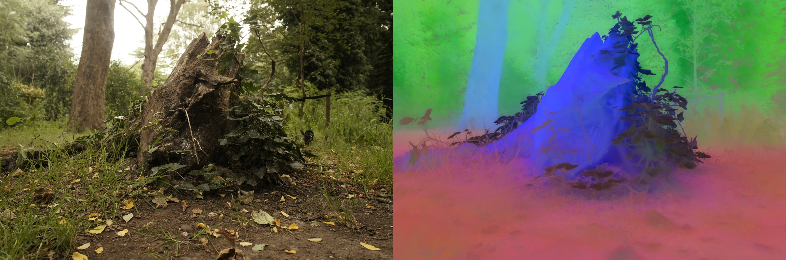
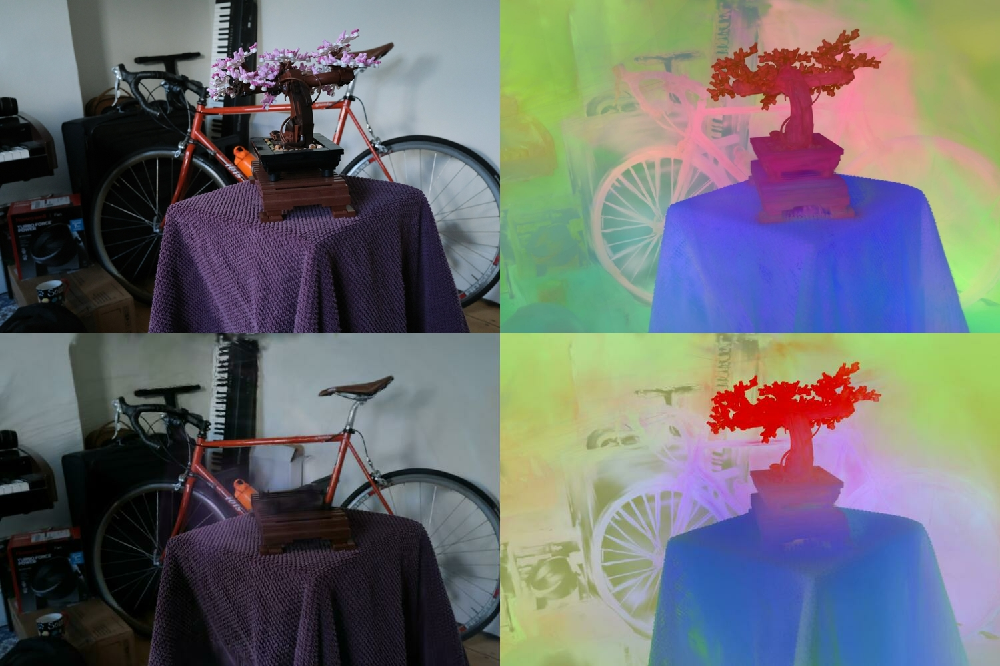

# LUDVIG: Learning-free Uplifting of 2D Visual features to Gaussian Splatting scenes

This repository contains code for [LUDVIG: Learning-free Uplifting of 2D Visual features to Gaussian Splatting scenes](https://juliettemarrie.github.io/ludvig/). LUDVIG uses a learning-free approach to uplift visual features from models such as DINOv2, SAM and CLIP into 3D Gaussian Splatting scenes. It refines 3D features, such as coarse segmentation masks, based on a graph diffusion process that incorporates the 3D geomtry of the scene and DINOv2 feature similarities. We evaluate on foreground/background and open-vocabulary object segmentation tasks.


*Illustration of the inverse and forward rendering between 2D visual features (produced by DINOv2) and a 3D Gaussian Splatting scene. In the inverse rendering (or uplifting) phase, features are created for each 3D Gaussian by aggregating coarse 2D features over all viewing directions. For forward rendering, the 3D features are projected on any given viewing direction as in regular Gaussian Splatting.*

## Table of Contents

1. [Setup](#setup)
2. [Project Structure](#project-structure)
3. [Demo](#demo)
   - [Demo for feature uplifting](#demo-for-feature-uplifting)
   - [Demo for open-vocabulary object removal](#demo-for-open-vocabulary-object-removal) 
4. [Reproducing results](#reproducing-results)
   - [Foreground/background segmentation](#foregroundbackground-segmentation)
   - [Open-vocabulary object localization](#open-vocabulary-object-localization)
5. [Citing LUDVIG](#citing-ludvig)
6. [License](#license)

## Setup

Clone the repo and `cd` into it
```
git clone git@github.com:naver/ludvig.git
cd ludvig
```
Run the following script to set the paths to your cuda dependencies, e.g. `cuda_path=/usr/local/cuda-11.8`:
```
bash script/set_cuda.sh ${cuda_path}
````
Modify the `pytorch-cuda` version in `environment.yml` to match your CUDA version, and create the `ludvig` environment:
```
mamba env create -f environment.yml
```
Our code has been tested on Ubuntu 22, CUDA 11.8 with GPU A6000 ADA (48GB of memory).

## Project Structure

The project in `ludvig/` is as follows:
- **`ludvig_*.py`**: Main scripts for uplifting, graph diffusion and evaluation.
- **`scripts/`**: Bash scripts calling `ludvig_*.py`
- **`configs/`**: Configuration files for different models and evaluation tasks.
- **`diffusion/`**: Classes for graph diffusion.
- **`evaluation/`**: Classes for evaluation, including segmentation on NVOS and SPIn-NeRF with SAM and DINOv2.

Additionally, you should have the following folders in `ludvig/`  (e.g. as symbolic links to storage locations):
- **`checkpoints/`**: Where model checkpoints should be stored. Our experiments use [DINOv2 ViT-g with registers](https://dl.fbaipublicfiles.com/dinov2/dinov2_vitg14/dinov2_vitg14_reg4_pretrain.pth), [SAM ViT-H](https://dl.fbaipublicfiles.com/segment_anything/sam_vit_h_4b8939.pth), [SAM2 Hiera Large](https://dl.fbaipublicfiles.com/segment_anything_2/072824/sam2_hiera_large.pt).
- **`dataset/`**: Where datasets should be stored.
- **`logs/`**: Where logs will be stored.

## Demo

### Data

For this demo, we use the `stump` and `bonsai` scenes from Mip-NeRF 360, with the pretrained Gaussian Splatting representation provided by the authors of Gaussian Splatting. <br>
First, download the scene and weights: 
```
bash script/demo_download.sh
```
This saves the data in `dataset/stump`,`dataset/bonsai` and model weights in `dataset/stump/gs`, `dataset/bonsai/gs`.

### Demo for feature uplifting
The following script will uplift DINOv2 features and save visualizations of the uplifted features:
```
python demo.py
```
The script creates an instance of [ludvig_uplift.LUDVIGUplift](./ludvig_uplift.py) based on paths to the data and on the configuration [configs/demo.yaml](./configs/demo.yaml). <br>
It then runs uplifting through `model.uplift()` and saves 3D features and visualizations through `model.save()`.

#### Feature map generation and uplifting

The method `model.uplift()`:
- creates a dataset from a subclass of [predictors.base.BaseDataset](./predictors/base.py) that generates the feature maps to be uplifted
- calls [utils.solver.uplifting](./utils/solver.py) to uplift the 2D feature maps generated by the dataset.

  <details>
  <summary>See details on the uplifting function</summary>
  
  The function [utils.solver.uplifting](./utils/solver.py) takes the following arguments:
  
  - **`loader`**: An iterable (in our case, an instance of `DINOv2Dataset`) that should yield `(feature, camera)` pairs. 
    - `feature`: A tensor of shape $(C, H, W)$.
    - `camera`: An instance of [`gaussiansplatting.scene.cameras.Simple_Camera`](./gaussiansplatting/scene/cameras.py).
  
  - **`gaussian`**: The Gaussian Splatting model, which is an instance of [`gaussiansplatting.scene.gaussian_model.GaussianModel`](./gaussiansplatting/scene/gaussian_model.py).
  </details>

For constructing 2D DINOv2 feature maps, we use the dataset [predictors.dino.DINOv2Dataset](./predictors/dino.py) (as indicated in `demo.yaml`). <br>
The dataset loads the scene images, predicts DINOv2 features and performs dimensionality reduction. <br>
<br>
Currently supported numbers of features are {1, 2, 3, 10, 20, 30, 40, 50, 100, 200, 256, 512}. If you need to uplift features with another dimension, you can add the option at line 421 [here](gaussiansplatting/submodules/diff-gaussian-rasterization/cuda_rasterizer/apply_weights.cu) and compile again.

**Directly uplifting existing 2D feature maps.** If you directly have features or masks to uplift, you can use [predictors.base.BaseDataset](./predictors/base.py) instead. The path to your features should be given as `directory` argument to the dataset, as in [configs/demo_rgb.yaml](./configs/demo_rgb.yaml). As a mock example, running `python demo.py --rgb` will directly uplift and reproject RGB images. <br>
Note that the name of your features should match camera names (*i.e.* the names of RGB images used for training).

#### Visualization and evaluation

The method `model.save()` saves uplifted features and visualizations in `logs/demo/`. <br>
You can also define your own postprocessing or evaluation procedure by subclassing [evaluation.base.EvaluationBase](./evaluation/base.py) and adding it to the configuration file under `evaluation`, as done in our experimental setup for SPIn-NeRF and NVOS and in the demo below.




### Demo for open-vocabulary object removal

In this demo, we will remove the `bonsai` from the downloaded scene using the text query "bonsai in a ceramic pot".
To this end, we:
1. uplift DINOv2 features using [configs/demo_removal_dinov2.yaml](./configs/demo_removal_dinov2.yaml)
2. uplift CLIP features using [configs/demo_removal_clip.yaml](./configs/demo_removal_clip.yaml)
3. run open-vocabulary object removal based on DINOv2 and CLIP features, using [configs/demo_removal_eval.yaml](./configs/demo_removal_eval.yaml)

The following script runs these three steps:
```
python demo_removal.py
```
Steps **1** and **2** are performed as in the previous demo, calling [predictors.dino.DINOv2Dataset](./predictors/dino.py) and [predictors.clip.CLIPDataset](./predictors/clip.py). Note that CLIP feature uplifting takes longer due to the sliding window mechanism used to generate CLIP feature maps.

Step **3** calls [evaluation.removal.clip_diffusion.CLIPDiffusionRemoval](./evaluation/removal/clip_diffusion.py), which computes 3D relevancy scores for the text query "bonsai in a ceramic pot". It then constructs a graph based on DINOv2 feature similarities, using the 3D CLIP relevancies to initialize the node weights and define the regularization term. <br>
The resulting 3D weights are thresholded to obtain a 3D segmentation mask. To remove the object, we simply remove all Gaussians pertaining to the 3D mask.

Various visualizations are saved in `logs/bonsai`, including:
- DINOv2 features in `logs/bonsai/dinov2/features/` (top-right image)
- CLIP features in `logs/bonsai/clip/features/` (bottom-right image)
- 2D RGB images rendered without the object in `logs/bonsai/removal` (bottom-left image).




## Reproducing results

The datasets should be stored in `ludvig/dataset`. <br>
All experiments require a trained Gaussian Splatting representation of the scene saved in a `gs/` folder under `dataset/${scene_path}/gs`, as indicated in the structures below.

### Foreground/background segmentation

#### Data

##### SPIn-NeRF

<details>
  <summary>Download instructions for SPIn-NeRF data</summary>

- **lego_real_night_radial**:  
  Download from [Google Drive](https://drive.google.com/file/d/1PG-KllCv4vSRPO7n5lpBjyTjlUyT8Nag/view?usp=sharing).

- **Tanks & Temples** (truck):  
  Download from the [Tanks & Temples website](https://www.tanksandtemples.org/download/).

- **NeRF LLFF data** (fern, fortress, horns, leaves, orchids, room):  
  Download from [Google Drive](https://drive.google.com/drive/folders/128yBriW1IG_3NJ5Rp7APSTZsJqdJdfc1).

- **nerf supervision** (fork):  
  Download from [Google Drive](https://drive.google.com/drive/folders/11uBvHlLfe1kNPUGlsah_OwyRoXK9OOkt).

</details>

The segmentation masks from the SPIn-NeRF data can be found [here](https://drive.google.com/file/d/1WRQ2ok4y4lw25YHw_bea328E8trqoB_V/view?usp=drive_link). After downloading the data, organize the data to match the following structure:
```plaintext
dataset/
├── SPIn-NeRF_data/
│   ├── fork/
│   │   ├── images/
│   │   └── gs/  
│   ├── lego/
│   └── ...
└── SPIn-NeRF_masks/
    ├── fork/
    ├── lego/
    └── ...
```

##### NVOS

The LLFF dataset is available [here](https://vistec-my.sharepoint.com/:f:/g/personal/pakkapon_p_s19_vistec_ac_th/ErjPRRL9JnFIp8MN6d1jEuoB3XVoxJkffPjfoPyhHkj0dg?e=qIunN0).
The scribbles and test masks are provided [here](https://jason718.github.io/nvos/).
<br> The data should have the following structure, with `gs/` containing the Gaussian Splatting logs:
```plaintext
dataset/
├── llff_data/
│   ├── fern/
│   │   ├── images/
│   │   └── gs/  
│   └── ...
└── llff_masks/
    ├── masks/
    ├── reference_image/
    └── scribbles/
```

#### Uplifting and evaluation

Uplifting and segmentation on SPIn-NeRF and NVOS:
```bash
    bash script/seg.sh $scene $cfg
```

with the following arguments:
- `scene`: The scene to evaluate, e.g., `trex`, `horns_center`, etc.
- `cfg`: Configuration file for evaluation, e.g., `dif_NVOS`, `sam_SPIn` (see below).

<details>
  <summary>Configuration files for foreground/background segmentation on SPIn-NeRF and NVOS</summary>
    
  - **`sam_[NVOS|SPIn]`**: segmentation on NVOS/SPIn-NeRF with SAM.
  - **`dif_[NVOS|SPIn]`**: segmentation on NVOS/SPIn-NeRF with DINOv2 and graph diffusion.
  - **`xdif_SPIn`**: segmentation on SPIn-NeRF with DINOv2, without graph diffusion.
  - **`depth_SPIn`**: segmentation on SPIn-NeRF with mask uplifting and reprojection.
  - **`singleview_[sam|dinov2]_SPIn`**: single-view segmentation with DINOv2 or SAM.
</details>


### Open-vocabulary object localization

#### Data

We evaluate on the extended version of the LERF dataset introduced by LangSplat.
[Download their data](https://github.com/minghanqin/LangSplat) and save Gaussian Splatting logs in a `gs/` folder as indicated in the structure below.
```plaintext
dataset/lerf_ovs
├── figurines/
│   ├── images/
│   └── gs/
├── ...
└── label/
    ├── figurines/
    └── ...   
```

#### Uplifting and evaluation

1. Uplift CLIP and DINOv2 features:
    ```bash
    bash script/lerf_uplift.sh $scene
    ```
    with `scene` one of `figurines`, `ramen`, etc. <br>
    The uplifted features are saved in `logs/lerf/$scene/clip` and `logs/lerf/$scene/dinov2`.

2. Evaluate the uplifted features on localization and segmentation tasks:
    ```bash
    bash script/lerf_eval.sh $scene $cfg [--no_diffusion]
    ```
    with `cfg` either `lerf_eval_sam` for segmentation with SAM or `lerf_eval` otherwise (automatic thresholding). Pass `--no_diffusion` to disable graph diffusion based on DINOv2 features. <br>
    To reproduce our results on object localization, you can run `bash scripts/lerf_eval.sh $scene lerf_eval --no_diffusion`. <br>
    The evaluation results (IoU and localization accuracy) are saved in `logs/lerf/$scene/iou.txt`, the mask predictions in `logs/lerf/$scene/masks*`, and the localization heatmaps in `logs/lerf/$scene/localization`.


## Citing LUDVIG

If you find our work useful, please consider citing us:
```
@article{marrie2024ludvig,
    title={LUDVIG: Learning-free Uplifting of 2D Visual features to Gaussian Splatting scenes},
    author={Marrie, Juliette and Menegaux, Romain and Arbel, Michael and Larlus, Diane and Mairal, Julien},
    journal={arXiv preprint arXiv:2410.14462},
    year={2024}
}
```

For any inquiries or contributions, please reach out to jltmarrie@gmail.com.

## License

*LUDVIG*, Copyright (C) 2024, 2025 Inria and NAVER Corp., CC BY-NC-SA 4.0 [License](./LICENSE.txt).
